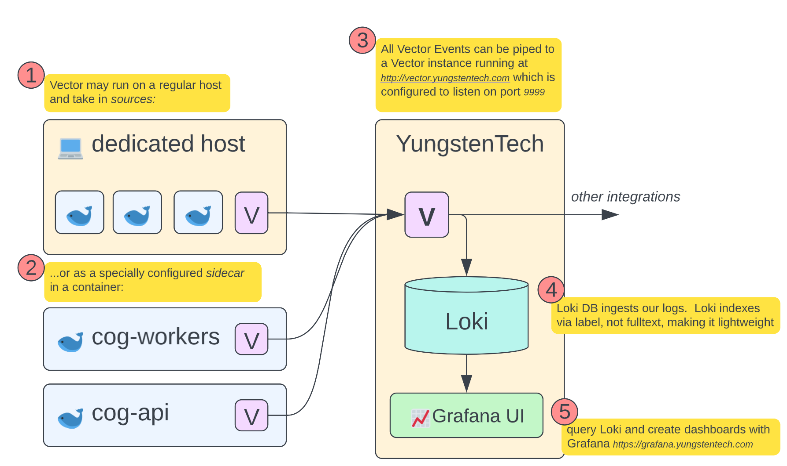

# vector

### Observability basics + VRL programs for Yungsten Tech

This folder contains basics about how observability is practiced in this stack using Vector.
This folder also containers `.vrl` or _Vector Remap Language_ files, which can be run against _Events_ that pass through the Vector pipelines.

**What is [Vector](https://vector.dev/docs/about/what-is-vector/)** ? It's a simple program that you can connect to itself/dabases to route messages!

More specifically, Vector is designed for sourcing, transforming, and routing observability data. Imagine if there was some way where you could just download a binary, plop a `config.toml` file, and then have all of your system logs go _[somewhere]_?

check it out...

## Example

```toml
[sources.anyTHINGyouWANT]
type = "stdin"

[sinks.beCREATIVE]
type = "vector"
inputs = [ "anyTHINGyouWANT" ]
address = "http://vector.yungstentech.com:9999"
```

that is literally the only configuration we would need to give a server somwhere to take whatever `stdin` gets from that computer, and send it to (_yet another_) instance of Vector running at YungstenTech.

It is super powerful that you can: **Vector** -> _send to_ -> **Vector**

## S3 Example

maybe you just want to send things to AWS S3 and stick these "message" events into a bucket:

```toml
[sources.anyTHINGyouWANT]
type = "stdin"

[sinks.beCREATIVE]
type = "aws_s3"
inputs = [ "anyTHINGyouWANT" ]
bucket = "my-bucket"
key_prefix = "date=%F/"
compression = "gzip"
region = "us-east-1"

  [sinks.my_sink_id.encoding]
  codec = "json"
```

> you can run sources and sinks in parallel too. For example you can have the `anyTHINGyouWANT` source send to both AWS S3 _and_ another place such as the Vector "aggregator" at Yungsten Tech

## Transforms

You have seen `sinks` in action, and you have seen `sources` in action. Let's look at `transforms`

With `transforms`, you can intercept messages between `sinks` and `sources`:

```toml
[sources.anyTHINGyouWANT]
type = "stdin"

[transforms.heeheeLOL]
type = "remap"
inputs = ["anyTHINGyouWANT"]
source = '''
  del(.json_key)
'''

[sinks.beCREATIVE]
type = "vector"
inputs = [ "heeheeLOL" ]
address = "http://vector.yungstentech.com:9999"
```

Here, we are using the `remap` transform to take the incoming message, and _map_ it (just like in TypeScript) into a new object, while calling the `del` function along the way, which as you can guess deletes some key called `json_key` from the JSON message that is incoming.

> You may have guessed by now that Vector is good with working with JSON logs, like most observability platforms. What happens if the logs is random, or custom, or a syslog? Vector can handle it. Below we show an example of how Vector has pre-built `sources` such as `syslog` in the **Syslog Example**

Some `transforms` that you might be interested in:

- [`add_fields`](https://assume-role-docs--vector-project.netlify.app/docs/reference/transforms/add_fields/) will add a set of key values within the TOML definition to the Vector event
- [`add_tags`](https://assume-role-docs--vector-project.netlify.app/docs/reference/transforms/add_tags/) will add a set of tags just like the keys
- [`aws_ec2_metadata`](https://assume-role-docs--vector-project.netlify.app/docs/reference/transforms/aws_ec2_metadata/) enrichs logs with AWS EC2 instance metadata
- [`coercer`](https://assume-role-docs--vector-project.netlify.app/docs/reference/transforms/coercer/) lets you cast values (JSON uses strings, make things into `int` if you wanna process them)
- [`json_parser`](https://assume-role-docs--vector-project.netlify.app/docs/reference/transforms/json_parser/) does what it says....it parses a _string_, expecting it to be JSON, and produces a workable JSON event for Vector
- [`remove_fields`](https://assume-role-docs--vector-project.netlify.app/docs/reference/transforms/remove_fields/) can remove sensitive information such as environment variables
- [`lua`](https://assume-role-docs--vector-project.netlify.app/docs/reference/transforms/lua/) runs your input 'script' in an entire embedded Lua enginge against your Vector event input. Go nuts. Write whatever.

> ⚠️ this is by all means not a full list! Check out all the available Vector Transforms [here](https://assume-role-docs--vector-project.netlify.app/docs/reference/transforms/).

## Syslog Example

Syslog is a standard format that system programs use to send their logs. Here is an example syslog:

```
<34>1 2003-10-11T22:14:15.003Z mymachine.example.com su - ID47 - BOM'su root' failed for lonvick on /dev/pts/8
```

Vector ships with a variety of `sources`, not just `file` as . Vector's lib ships with sources for [docker](https://assume-role-docs--vector-project.netlify.app/docs/reference/sources/docker/), [journald](https://assume-role-docs--vector-project.netlify.app/docs/reference/sources/journald/), [prometheus](https://assume-role-docs--vector-project.netlify.app/docs/reference/sources/prometheus/), [socket](https://assume-role-docs--vector-project.netlify.app/docs/reference/sources/socket/), [statsd](https://assume-role-docs--vector-project.netlify.app/docs/reference/sources/statsd/), [kafka](https://assume-role-docs--vector-project.netlify.app/docs/reference/sources/kafka/), and more. Watch how simple it is to listen for syslogs as a syslog server:

```toml
[sources.my_source_id]
  type = "syslog" # must be: "syslog"
  mode = "tcp" # example, enum
  address = "0.0.0.0:9000" # example, no default, relevant when mode = "tcp" or mode = "udp"
  path = "/path/to/socket" # example, no default, relevant when mode = "unix"
```

... and now you can route it anywhere!

## VRL Language

The original intent of this utility folder was to house `.vrl` files for Vector. VRL files are written in [_Vector Remap Language_](https://vector.dev/docs/reference/vrl/), and are parsed by the `remap` transform that Vector gives us in the toolbox 🔧.

At its simplest form, you can call Vector Remap Language inside of the Vector `.toml` file that is used to boot the Vector binary:

```toml
[transforms.vectorREMAPlanguageEXAMPLE]
type = "remap"
inputs = ["someINPUT"]
source = '''
  del(.user_info)
'''
```

...just like in the example above, here we are calling the VRL `del` function on the expected `user_info` field for this [_Vector Event_](https://vector.dev/docs/about/under-the-hood/architecture/data-model/).

Let's try and run a VRL "program" to practice VRL:
1.) create a file named `app.log` and put the following logline inside:

```
{"level":"DEBUG","message":"environment is NOT \"development\", 'production'","fileName":"configure.js","fileLine":"8","date":"2023-01-18T23:17:17.466Z","hostname":"mac-2","runtime":"Nodejs","runtimeVersion":"14.19.0","levelId":2}
```

2.) create the VRL program in a file named `program.vrl`:

```vrl
.fileLine = to_int!(.fileLine)
```

3.) let's run the vector binary with `program.vrl` against this input:

```bash
vector vrl --input app.log --program program.vrl --print-object
```

#### Advanced VRL Example

Above we simple ran a VRL program to cast the `fileLine` object in the Vector Log Event to an `int`.

The following VRL program will also parse the ISO date, cast, the line number, and include some information about the environment for the application's resulting build:

```vrl
.fileLine = to_int!(.fileLine)
.date = parse_timestamp(.date, "%Y-%m-%dT%H:%M:%S%.3f%z") ?? now()
service, err = get_env_var("COG_SERVICE_BUILD_NAME")
.level = to_int!(.levelId)
if err != null {
  . = merge(., {
    "application": "cog",
    "service": "unknown"
  })
} else {
    . |= {
    "application": "cog",
    "service": service
  }
}
```

save the above to `program.vrl` and you can see the parsed output:

```bash
vector vrl --input app.log --program program.vrl --print-object
```

VRL has literally an entire [library of functions](https://vector.dev/docs/reference/vrl/functions/), you can use it like any old programming language.

## Vector at Yungsten Tech

This will likely change as time goes on, but at the time of writing, we use Vector as an Agent to collect logs in various locations, and then forward them all "home" to our Vector Aggregator, which can then spit out our information however we see fit.

At this time, we use Grafana Loki to store our logs because it is cheap and efficient to run, and integrates well with Grafana.



## TypeScript Example at Yungsten Tech

Let's look at how the Cog application sends logs through our Vector pipeline.
When trying to figure out how to get something to integrate into the Vector pipeline, we need to answer:

1. What do the current logs looks like
2. Where/how can I source the output that those logs will produce at runtime
3. Do I want to transform/remap anything?
4. Where do I send these logs

First, let's examine how Cog produces logs.

As suggested for apps in this monorepo, Cog first imports the custom logging package:

```Typescript
import { logging } from "@yungsten/utils";

export const server = async function (commandLineArgs: string[]) {
  const logger = logging.createLogger();
  logger.log("starting api");
  ...
```

This logger already outputs a nice JSON log, and a if we look at the logger, notice a file `app.log` in the directory of the runtime app will be emitted.

We have answered (1) and (2), we know since we are using the custom logger we will get JSON logs, and those logs will appear as `app.log` inside of `apps/cog`

Because Cog is designed to run _anywhere_ on _any machine_, we want to build Vector into the Docker image. This means that the `config.toml` will also be built into the image.

Inside of the `apps/cog` directory, we will notice a `vector.toml` file (notice that the file name does not matter). We will decide for question (3) that we want to remap some values. We want to cast the `date` from the logs to a real Date object that Vector can perform logic with. We also want to do things like add some environment variables:

```toml
[sources.main_stdin]
type = "file"
include = ["apps/cog/*.log"]

[transforms.extract_logs]
  type = "remap"
  inputs = ["main_stdin"]
  source = """
    .fileLine = to_int!(.fileLine)
    .date = parse_timestamp(.date, "%Y-%m-%dT%H:%M:%S%.3f%z") ?? now()
    service, err = get_env_var("COG_SERVICE_BUILD_NAME")
    .level = to_int!(.levelId)
  """

[transforms.add_fields]
  type = "remap"
  inputs = ["extract_logs"]
  source = '''
    if err != null {
      . = merge(., {
        "application": "cog",
        "service": "unknown"
      })
    } else {
        . |= {
        "application": "cog",
        "service": service
      }
    }
  '''
```

lastly, to answer question (4), we need to add this to the end of the text above to complete the `vector.toml` configuration for the Vector instance that will be baked inside of the Cog Docker build. Here is that last bit of text to configure the `sink` output:

```toml
[sinks.vector_home]
type = "vector"
inputs = [ "add_fields" ]
address = "http://vector.yungstentech.com:9999"
```

You will notice that Vector gets installed in the Cog Docker image at the very end:

```Dockerfile
RUN curl --proto '=https' --tlsv1.2 -sSf https://sh.vector.dev | bash -s -- -y
```

When the Docker container that was created by this Dockerfile gets booted up, Vector gets run first (in the background using the `&` operator in bash), and then the main application that was designated to run inside of that Docker container.
Vector startup command:

```bash
${VECTOR_PATH} --config apps/cog/vector.toml &
```
